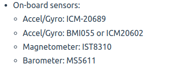

# UAV Concepts Exploration

## UAV vs Drone

A drone is an unmanned aircraft or ship that is guided remotely or autonomously whereas a UAV is simply an Unmanned Aerial Vehicle, something that can fly without a pilot onboard.

## IMU Sensor

An IMU (inertial measurement unit) is a device that combines inertial sensors – gyroscopes and accelerometers – to provide acceleration and orientation data that can be used to calculate position and velocity. Some models of IMU also incorporate magnetometers, which outputs measurements of the Earth’s magnetic field that can be used to improve the accuracy of orientation measurements. IMUs typically have one of each sensor per axis being measured, up to a maximum of three axes for measuring roll, pitch and yaw.

IMUs are used for a variety of applications in UAVs and drones. They allow the aircraft to maintain stability and control while experiencing high winds or performing steep turning manoeuvres. They can also be used to enable highly accurate station-keeping or autonomous waypoint following.

It is used to measure force, magnetic field and angular rate. These sensors include
* 3-axis accelerometer
* 3-axis gyroscope
* 3-axis magnetometer (optional)

Addition of the magentometer it a 9-axis IMU, or else it can be considered as a 6-axis IMU.

### Accelerometer

An accelerometer measures proper linear acceleration. Proper acceleration is the physical acceleration as experienced by an object in its own instantaneous rest frame, which is different from the acceleration in a fixed coordinate frame. An accelerometer at rest on the table will measure +1g upwards, away from the center of the earth. If the accelerometer is in free fall, it will measure zero acceleration.

Accelerometers are used to monitor vibrations in rotating machines and in inertial navigation systems. 

Two accelerometers coordinated with each other can measure differences in proper acceleration, depending on their separation, thus the gradient of the gravitational field. 

### Gyroscope

A gyroscope is a device that uses Earth's gravity to help determine orientation. Gyro sensors are devices that sense angular velocity which is the change in rotational angle per unit of time. 3-axis gyroscopes are often implemented with a 3-axis accelerometer to provide a full DoF motion tracking system. 

For example, a gyroscope could be used in an aircraft to help indicate the rate of rotation around the aircraft roll axis. When the aircraft comes to rest rotationally, the gyroscope reading will become zero. The gyroscope reading stays non-zero only as long as there is rotational motion and will be non-zero only in the axes around which the rotational motion is taking place.

Guided missiles use gyroscopes to track and guide their courses.

### Magnetometer

Magnetometers allow measurement of strength and sometimes direction of magnetic field at a point in space. Magnetometers are also used to calibrate electromagnets and permanent magnets and to determine the magnetization of materials. 

They are used to measure the Earth's magnetic field in geographical surveys, metals/weapons detectors etc.

## Inertial Navigation System (INS)

Also known as Inertial Guidance System, used in UAVs, USVs and UGVs.

Inertial Navigation is a self-referential method by which a system may track its own position, orientation and velocity (once the initial values for these parameters are provided) without the need of external references like landmarks, celestial objects, satellites etc.

For instance, if the acceleration of a body is known, mathematical integration will give the velocity. In this manner, accelerometers can be used for inertial navigation.

At least three orthogonal rate-gyros and three orthogonal accelerometers are used and are used to derive a navigation solution. This navigation solution contains atleast the position (latitude and longitude).

A rate-gyro measures rate of change of angle with time instead of the direction

The orientation of the system can be tracked using gyroscopes, which measure angular rate (change in angular velocity). This angular rate is integrated to track the angular position of the system.

Magnetometers can be used to measure the strength and direction of the earth's magnetic field, and can be used to calculate the system yaw and heading.

INS are autonomous after initialization and do not rely on satellites like GPS systems. They are also resistant to external radiation and jamming to a great extent.

But INS provide accurate solutions for a short period of time. As the acceleration is intergrated twice to obtain position, the error also gets integrated and accumulates over time.

### INS for UAVs

The aim of using INS in an UAV would be to determine its position, velocity and altitude using only the onboard sensors. Some major components to be considered would be
* inertial sensors like those in an IMU (acceleromter, gyro, magnetometer)
* posititoning of the sensors on the UAV
* a computational unit that can carry out operations like integration and filtration of the sensor data to obtain required values

The integration of the IMU and a post-processing unit can be called an Altitude and Heading Reference System (AHRS). Data from the IMU is taken to this unit and altitude, heading is calculated. Kalman Filtering is used for the estimation.

## Sensor Fusion

Combining sensor data obtained from different sources such that the data obtained is more accurate than any of the initial data that was received individually. Examples of the most popularl used sensor fusion algorithms would be the Kalman Filter, Extended Kalman Filter.

### Kalman Filter

The Kalman filer is an algorithm that uses a series of measurements obtained over time, containing statistical noise and inaccuracies and uses them to produce estimates of unknown variables. These estimates tend to be more accurate than those based on a single measurement alone. 

The Kalman Filter deals with Gaussian Distribution curves, which is also its output. Once a measurement update is complete, the Kalman Filter outputs a unimodal Gaussian distribution which is its best guess of the parameter's true value. The mean of the Gaussian curve signifies the most probable occurence of the value and it lies at the centre.

In the above image, the curve indicated as Prior Belief is the initial value at the beginning of the process and the previous state estimate in subsequent iterations. The curve marked as Measurement shows the value of the parameter as measured by the sensor, which is assumed to be noisy and inaccurate.

The Kalman Filter uses the above formulae to calculate the posterior mean and variance, which are the updated values of the Prior Belief after taking the Measurement into consideration. These posterior values provide the state estimate of the Kalman Filter at that instant and is used as the Prior Belief for the next iteration. 

But with this approach arises an issue. If the input to Kalman Filter is a linear function, it outputs a Gaussian curve. But a non-linear, non-Gaussian input leads to Non-Gaussian output. The Kalman Filter will not work for this non-linear Gaussian Distribution and we cannot calculate its mean and variance such that it is still meaningful. This is why the need for the Extended Kalman Filter arises.

The Extended Kalman Filter simply adds a step to the preprocessing before giving input to the Kalman Filtering Estimation step. It approximates the non-linear function as a linear one using the Taylor Series Equation. 

## Pixhawk

Pixhawk is an independent open-hardware project providing autopilot designs that are readily available, low-cost and high-end in nature. 

It basically is a series of dedicated flight controllers for UAVs. It brings together the different components needed to run open-source software for a drone into a box. It behaves like the Arduino of drones.

Some advantages of using a Pixhawk controller include: 
* Wide Software SupportS
* Multiple hardware peripherals can be attached to the board
* well-tested and reliable

### Flight Controllers
A flight controller behaves as the brain of the drone. It monitors and controls drone activity. 

### IMUs in a Pixhawk Controller

Generally a Pixhawk controller is mounted with two different IMU sensors, of different brands

## References 

### Basics
* https://www.identifiedtech.com/blog/uav-surveying/drone-technology-ending-the-drone-vs-uav-debate-drone-basics-101/#:~:text=A%20drone%20is%20an%20unmanned,named%20for%20it's%204%20propellers.

### IMU sensor
* https://www.youtube.com/watch?v=M9lZ5Qy5S2s
* https://www.unmannedsystemstechnology.com/expo/inertial-measurement-units-imu/#:~:text=An%20IMU%20(inertial%20measurement%20unit,to%20calculate%20position%20and%20velocity.
* 

#### Accelerometer
* https://www.digikey.com/en/articles/using-an-accelerometer-for-inclination-sensing
* https://en.wikipedia.org/wiki/Accelerometer

#### Gyroscope
* https://www.youtube.com/watch?v=MAR4yvxQpzc
* https://in.element14.com/sensor-gyroscope-technology#:~:text=A%20gyroscope%20is%20a%20device,s%20(degrees%20per%20second)

#### Magnetometer
* https://www.britannica.com/technology/magnetometer

### INS
* https://www.vectornav.com/resources/inertial-navigation-articles/what-is-an-ins
* https://www.sciencedirect.com/topics/engineering/inertial-navigation-system
* https://www.smlease.com/entries/mechanical-design-basics/what-is-the-difference-between-roll-pitch-yaw-aircraft-motions/
* https://www.researchgate.net/figure/a-Pitch-yaw-and-roll-angles-of-an-aircraft-with-body-orientation-O-u-v-original_fig7_348803228
* https://www.uavnavigation.com/company/blog/uav-navigation-depth-inertial-navigation

### Sensor Fusion
#### Kalman Filter
* Udacity's RObotics Software Engineer - Nanodegree Program
* https://towardsdatascience.com/extended-kalman-filter-43e52b16757d

### Pixhawk
* https://ardupilot.org/copter/docs/common-px4fmu-overview.html
* https://docs.px4.io/main/en/flight_controller/pixhawk_series.html
* https://robotics.stackexchange.com/questions/5053/why-does-the-pixhawk-have-2-imus#:~:text=This%20is%20because%20the%20chances,IMUs%20all%20of%20different%20brands
* https://www.rcgroups.com/forums/showthread.php?1987175-Pixhawk-from-3D-Robotics-and-PX4/page483
* https://github.com/3drobotics/Pixhawk_OS_Hardware/blob/master/FMUv3_REV_G/Schematic%20Print/Schematic%20Prints.PDF

